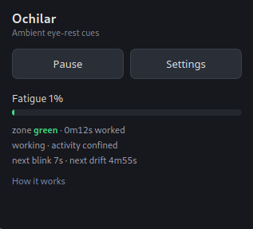
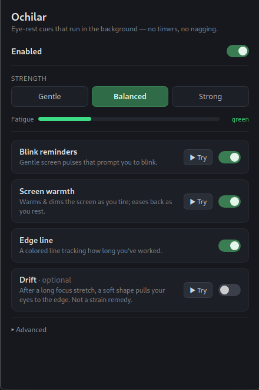
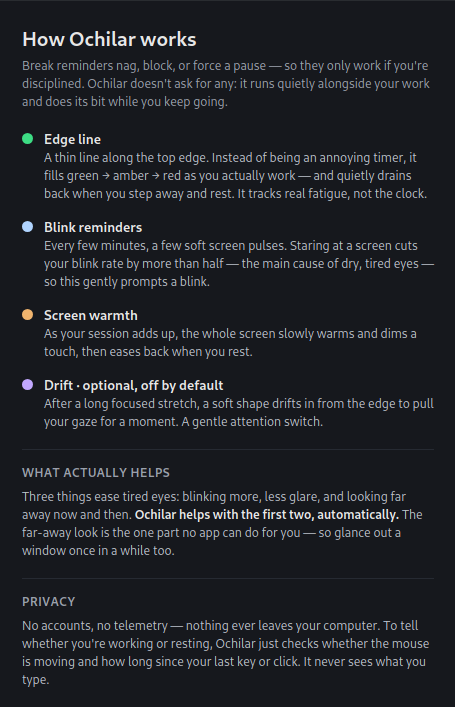

# Ochilar

Ambient eye-rest cues for Linux. It sits quietly over your work and nudges your
eyes. No break timers, no popups, no blocking, nothing to remember or click.
Most "look away every 20 minutes" tools nag you or lock your screen, which only
works if you're disciplined enough to obey them. This one just runs in the
background and does its bit while you keep going.

| Control window | Settings | How it works |
| :---: | :---: | :---: |
|  |  |  |

## What it does

- A thin line along the top edge fills green to red as you work, and drains
  back when you rest. It tracks actual focused time, not the clock.
- Every few minutes the screen dims for a fraction of a second, a few times in
  a row, to prompt a blink. (Staring at a screen roughly halves your blink rate,
  which is the main thing that dries your eyes out.)
- The whole screen slowly warms and dims a little as you get tired, then eases
  back when you take a break.
- Optionally, after a long focused stretch, a soft shape drifts across the
  screen to pull your gaze to the edge. Off by default.

To tell whether you're working or resting it checks how long since your last
input and roughly where the cursor is, all locally. It never reads what you
type and it makes no network connections.
## What it isn't

It is not a medical thing. It won't prevent eye damage or improve your eyesight.
It's a comfort aid for tired, dry eyes. If your eyes actually hurt, see an
optometrist, not an app.

## Running it

It's a [Tauri](https://tauri.app) app (Rust + a bit of TypeScript). You'll need
Rust, Node, the usual Tauri/webkit2gtk build dependencies, and `xprop`.

```
npm install
npm run tauri dev      # run in dev
npm run tauri build    # build an installable (.rpm / .deb)
```

## Notes

- X11 only. It leans on X11-specific things (the ScreenSaver extension, SHAPE,
  RandR gamma, window-opacity atoms), so it does not run on Wayland.
- Built and tested on Fedora KDE (KWin) and Gnome Ubuntu. A good chunk of the overlay code is
  working around how KWin composites transparent click-through windows.

